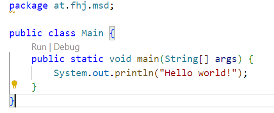
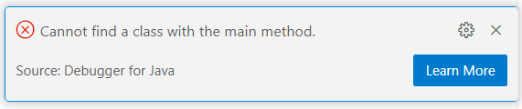
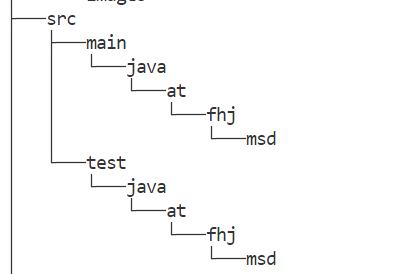

#  🍹 Drink_Queue_Project

**A simple program written in Java** designed to teach and practice the following concepts:

-  How to turn abstract ideas (queue operations) into working code.
-  How to use arrays to store elements.
-  Polymorphism: A reference of type IQueue can point to any implementation.
-  Good practice: Interfaces are preferred over concrete classes for flexible design.
-  Encapsulation: Classes hide their internal data (e.g., queue state) and provide public methods.
-  Polymorphism: Methods like peek() and element() have the same purpose but different error behavior.
  

## 🏗️ Features

1. Drink.java - abstract base class.

2. Liquid.java - class for liquid ingredients (alcohol, juice).

3. SimpleDrink.java - represents a drink with a single liquid.

4. StringQueue.java - implementation of a queue.

5. IQueue - describes the behavior of a queue for working with strings.

6. Main.java - a standard body of a Main class.

7. Cocktail.java - represents a cocktail drink consisting of multiple liquid ingredients.

8. DrinkQueue.java - implementing Drink interface in a queue.
   
## ⚔️Getting Started


1. Clone the repository or download the source code.
   
To clone this project, run:

```
bash git clone https://github.com/rozaliyaAleksandrova/Drink_Queue_Project 
```
Or copy the code from the README.md you are currently reading.


2. 📝 Аdd main method.\
   
3. If you try to run the code without a main method you will get the following message in VSCODE

   
4. Compile the Java files using a Java compiler. A compiler can be downloaded from here:
   [jetbrain](//www.jetbrains.com)

We recommend:
[IntelliJ IDEA](https://www.jetbrains.com/idea/)
or
[Visual Studio Code](//www.jetbrains.com)

[Problems with the installation? Click here!](https://www.jetbrains.com/help/idea/getting-started.html)

1. Run the `main()` method in the Main class to see the output of the code.

### 📊 Example Output

When you run the application, you will see an output similar to the following:


## 🛠️ Copying the code

`1. class Drink:`
```
package at.fhj.msd;

/**
 * Represents a drink with volume, alcohol percentage and name.
 */
public interface Drink {

    /**
     * Returns the volume of the drink in liters.
     * @return volume in liters
     */
    double getVolume();

    /**
     * Returns the alcohol percentage of the drink.
     * @return alcohol percentage (e.g., 5.5 for 5.5%)
     */
    double getAlcoholPercent();

     /**
     * Checks if the drink contains alcohol.
     * @return true if alcohol > 0, false otherwise
     */
    boolean isAlcoholic();

    /**
     * Returns the name of the drink.
     * @return drink name
     */
    String getName();

    /**
     * Sets the name of the drink.
     * @param name new name of the drink
     */
    void setName(String name);
}
```

`2. class Liquid: `
```
package at.fhj.msd;

/**
 * Represents a liquid used in drinks, with name, volume and alcohol percentage.
 */
public class Liquid {
    private String name;
    private double volume;
    private double alcoholPercent;

    /**
     * Constructor to create a Liquid object.
     * @param name name of the liquid
     * @param volume volume in litres
     * @param alcoholPercent alcohol percentage
     */
    public Liquid(String name, double volume, double alcoholPercent) {
        this.name = name;
        this.volume = volume;
        this.alcoholPercent = alcoholPercent;
    }

    /**
     * Gets the name of the liquid.
     * @return name
     */
    public String getName() {
        return name;
    }

    /**
     * Sets the name of the liquid.
     * @param name new name
     */
    public void setName(String name) {
        this.name = name;
    }

    /**
     * Gets the volume.
     * @return volume in litres
     */
    public double getVolume() {
        return volume;
    }

    /**
     * Sets the volume.
     * @param volume new volume
     */
    public void setVolume(double volume) {
        this.volume = volume;
    }

    /**
     * Gets alcohol percentage.
     * @return alcohol percentage
     */
    public double getAlcoholPercent() {
        return alcoholPercent;
    }

    /**
     * Sets alcohol percentage.
     * @param alcoholPercent new alcohol percentage
     */
    public void setAlcoholPercent(double alcoholPercent) {
        this.alcoholPercent = alcoholPercent;
    }
}
```

`3. class SimpleDrink:`
```
package at.fhj.msd;

/**
 * Class represents a simple drink liquid which can be used in drinks.
 */
public class SimpleDrink implements Drink {

    /**
     * The only liquid contained in the drink.
     */
    protected Liquid l;

    /**
     * Name of the drink.
     */
    protected String name;

    /**
     * Creates a SimpleDrink object with given name and liquid.
     *
     * @param name name of drink
     * @param l only liquid in drink
     */
    public SimpleDrink(String name, Liquid l) {
        this.name = name;
        this.l = l;
    }

    /**
     * Returns volume of the liquid.
     *
     * @return the volume of drink in litre
     */
    @Override
    public double getVolume() {
        return l.getVolume();
    }

    /**
     * Returns alcohol volume percent of the liquid.
     *
     * @return alcohol volume percent
     */
    @Override
    public double getAlcoholPercent() {
        return l.getAlcoholPercent();
    }

    /**
     * Gives information if drink is alcoholic or not.
     *
     * @return true when alcoholic liquids are present, otherwise false
     */
    @Override
    public boolean isAlcoholic() {
        return l.getAlcoholPercent() > 0;
    }

    /**
     * Returns name of drink.
     *
     * @return name of drink
     */
    @Override
    public String getName() {
        return name;
    }

    /**
     * Sets the name of the drink.
     *
     * @param name name to set
     */
    @Override
    public void setName(String name) {
        this.name = name;
    }

    /**
     * Returns the liquid used in the drink.
     *
     * @return liquid
     */
    public Liquid getLiquid() {
        return l;
    }

    /**
     * Sets the liquid used in the drink.
     *
     * @param l liquid to set
     */
    public void setLiquid(Liquid l) {
        this.l = l;
    }
}
```

`4. class StringQueue:`
```
package at.fhj.msd;

import java.util.ArrayList;
import java.util.List;
import java.util.NoSuchElementException;

/**
 * Implementation of a simple String Queue using a List.
 */
public class StringQueue implements IQueue {
    private List<String> elements = new ArrayList<>();
    private int maxSize;

    /**
     * Constructor to create a StringQueue object with a specified maximum size.
     * @param maxSize the maximum number of elements the queue can hold
     */
    public StringQueue(int maxSize) {
        this.maxSize = maxSize;
    }

    /**
     * Adds an element to the tail of the queue.
     * @param obj the String object to add
     * @return true if the element was added successfully, false if the queue is full
     */
    @Override
    public boolean offer(String obj) {
        if (elements.size() < maxSize) {
            elements.add(obj);
            return true;
        }
        return false; // Queue ist voll
    }

    /**
     * Retrieves and removes the head of the queue, or returns null if the queue is empty.
     * @return the head of the queue or null if the queue is empty
     */
    @Override
    public String poll() {
        if (elements.isEmpty()) {
            return null;
        }
        return elements.remove(0);
    }

    /**
     * Retrieves and removes the head of the queue.
     * @return the head of the queue
     * @throws NoSuchElementException if the queue is empty
     */
    @Override
    public String remove() {
        String element = poll();
        if (element == null) {
            throw new NoSuchElementException("The queue is empty");
        }
        return element;
    }

    /**
     * Retrieves, but does not remove, the head of the queue, or returns null if the queue is empty.
     * @return the head of the queue or null if the queue is empty
     */
    @Override
    public String peek() {
        if (elements.isEmpty()) {
            return null;
        }
        return elements.get(0);
    }

    /**
     * Retrieves, but does not remove, the head of the queue.
     * @return the head of the queue
     * @throws NoSuchElementException if the queue is empty
     */
    @Override
    public String element() {
        String element = peek();
        if (element == null) {
            throw new NoSuchElementException("The queue is empty");
        }
        return element;
    }
}
```


`5. public interface IQueue:`
```
package at.fhj.msd;

/**
 * Interface for a Queue data structure.
 */
public interface IQueue {

    /**
     * Adds an object to the end of the queue.
     *
     * @param obj The object to be added.
     * @return {@code true} if the object was successfully added, otherwise {@code false}.
     */
    boolean offer(String obj);

    /**
     * Removes and returns the first element of the queue.
     * If the queue is empty, returns {@code null}.
     *
     * @return The first element of the queue or {@code null} if the queue is empty.
     */
    String poll();

    /**
     * Removes and returns the first element of the queue.
     * If the queue is empty, throws a {@link java.util.NoSuchElementException}.
     *
     * @return The first element of the queue.
     * @throws java.util.NoSuchElementException if the queue is empty.
     */
    String remove();

    /**
     * Retrieves, but does not remove, the first element of the queue.
     * If the queue is empty, returns {@code null}.
     *
     * @return The first element of the queue or {@code null} if the queue is empty.
     */
    String peek();

    /**
     * Retrieves, but does not remove, the first element of the queue.
     * If the queue is empty, throws a {@link java.util.NoSuchElementException}.
     *
     * @return The first element of the queue.
     * @throws java.util.NoSuchElementException if the queue is empty.
     */
    String element();
}
```
`6. public class Main:`
 - **The main method is the starting point of the application.**
In your main() method, you can create the drinks and then call the method.
-  This is a standard body of a Main class, to see an example of the program's application, look in the section: ⬇️ 🎊 How to make the code more interesting 🎊 ⬇️

```
package at.fhj.msd;

public class Main {
    public static void main(String[] args) {
        System.out.println("Hello world!");
        
        ...
    }
}

```
`7.  public class Cocktail:`
```
package at.fhj.msd;

import java.util.List;

/**
 * Class represents a cocktail drink consisting of multiple liquid ingredients.
 * Implements the Drink interface.
 */
public class Cocktail implements Drink {

    private String name;
    private List<Liquid> ingredients;

    /**
     * Constructor to create a Cocktail object.
     * @param name name of the cocktail
     * @param ingredients list of liquids
     */
    public Cocktail(String name, List<Liquid> ingredients) {
        this.name = name;
        this.ingredients = ingredients;
    }

    /**
     * Returns total volume of the drink.
     * @return total volume
     */
    @Override
    public double getVolume() {
        return ingredients.stream()
                          .mapToDouble(Liquid::getVolume)
                          .sum();
    }

    /**
     * Calculates and returns alcohol percent based on all ingredients.
     * @return alcohol percent
     */
    @Override
    public double getAlcoholPercent() {
        double totalVolume = getVolume();
        if (totalVolume == 0) return 0;
        double alcoholSum = ingredients.stream()
            .mapToDouble(l -> l.getVolume() * l.getAlcoholPercent())
            .sum();
        return alcoholSum / totalVolume;
    }

    /**
     * Checks if the drink contains any alcohol.
     * @return true if any ingredient is alcoholic
     */
    @Override
    public boolean isAlcoholic() {
        return ingredients.stream()
                          .anyMatch(l -> l.getAlcoholPercent() > 0);
    }

    /**
     * Gets the name of the cocktail.
     * @return name
     */
    @Override
    public String getName() {
        return name;
    }

    /**
     * Sets the name of the cocktail.
     * @param name new name
     */
    @Override
    public void setName(String name) {
        this.name = name;
    }

    /**
     * Gets the list of ingredients.
     * @return ingredients
     */
    public List<Liquid> getIngredients() {
        return ingredients;
    }

    /**
     * Sets the list of ingredients.
     * @param ingredients new list of ingredients
     */
    public void setIngredients(List<Liquid> ingredients) {
        this.ingredients = ingredients;
    }
}
```
`8. public class DrinkQueue:`
```
package at.fhj.msd;
import java.util.LinkedList;
import java.util.Queue;
import java.util.NoSuchElementException;

/**
 * Class to manage drinks implementing Drink interface in a queue.
 */
public class DrinkQueue {

    private Queue<Drink> drinks;

    /**
     * Initializes the DrinkQueue.
     */
    public DrinkQueue() {
        drinks = new LinkedList<>();
    }

    /**
     * Adds a drink to the queue.
     *
     * @param drink the Drink object to add
     * @return true if added successfully
     */
    public boolean offer(Drink drink) {
        return drinks.offer(drink);
    }

    /**
     * Retrieves and removes the head of the queue, or returns null if empty.
     *
     * @return the head of the queue or null if queue is empty
     */
    public Drink poll() {
        return drinks.poll();
    }

    /**
     * Retrieves and removes the head of the queue.
     *
     * @return the head of the queue
     * @throws NoSuchElementException if queue is empty
     */
    public Drink remove() {
        return drinks.remove();
    }

    /**
     * Retrieves but does not remove the head of the queue, returns null if empty.
     *
     * @return the head of the queue or null if queue is empty
     */
    public Drink peek() {
        return drinks.peek();
    }

    /**
     * Retrieves but does not remove the head of the queue.
     *
     * @return the head of the queue
     * @throws NoSuchElementException if queue is empty
     */
    public Drink element() {
        return drinks.element();
    }

    /**
     * Checks if the queue is empty.
     *
     * @return true if queue is empty, false otherwise
     */
    public boolean isEmpty() {
        return drinks.isEmpty();
    }

    /**
     * Returns the number of drinks in the queue.
     *
     * @return size of queue
     */
    public int size() {
        return drinks.size();
    }
}

```


## 🎊 How to make the code more interesting 🎊

You can create the drinks in your main() method in the Main class and then call the method:
```
package at.fhj.msd;

import java.util.Arrays;
import java.util.List;

public class Main {
    public static void main(String[] args) {
        // 1. Creating of simple liquids
        Liquid water = new Liquid("Water", 0.5, 0);
        Liquid vodka = new Liquid("Vodka", 0.05, 40);
        Liquid cola = new Liquid("Cola", 0.33, 0);
        
        // 2. Making simple drinks
        Drink waterDrink = new SimpleDrink("Mineral Water", water);
        Drink vodkaDrink = new SimpleDrink("Vodka Shot", vodka);
        Drink colaDrink = new SimpleDrink("Cola", cola);
        
        // 3. Creating a cocktail
        List<Liquid> mojitoIngredients = Arrays.asList(
            new Liquid("Rum", 0.04, 40),
            new Liquid("Soda Water", 0.15, 0),
            new Liquid("Lime Juice", 0.01, 0)
        );
        Drink mojito = new Cocktail("Mojito", mojitoIngredients);
        
        // 4. Demonstration of the beverages
        System.out.println("=== Simple drinks ===");
        printDrinkInfo(waterDrink);
        printDrinkInfo(vodkaDrink);
        printDrinkInfo(colaDrink);
        
        System.out.println("\n === Cocktail ===");
        printDrinkInfo(mojito);
        
        // 5. Using a beverage queue
        DrinkQueue drinkQueue = new DrinkQueue();
        drinkQueue.offer(waterDrink);
        drinkQueue.offer(vodkaDrink);
        drinkQueue.offer(mojito);
        
        System.out.println("\n === Serving drinks from a queue ===");
        while (!drinkQueue.isEmpty()) {
            Drink served = drinkQueue.poll();
            System.out.println("Сервирана: " + served.getName());
        }
    }
    
    private static void printDrinkInfo(Drink drink) {
        System.out.println("Drink: " + drink.getName());
        System.out.printf("Volume: %.2f литра\n", drink.getVolume());
        System.out.printf("Alcohol: %.1f%%\n", drink.getAlcoholPercent());
        System.out.println("Alcoholic: " + (drink.isAlcoholic() ? "Yes" : "No"));
        System.out.println();
    }
}

```


## Testing your code 

```
package at.fhj.msd;

import java.util.ArrayList;
import java.util.Arrays;
import java.util.List;

public class Main {
    public static void main(String[] args) {
        System.out.println("Testing Drink System Implementation\n");

        // Test 1: Basic Liquid functionality
        System.out.println("=== Testing Liquid Class ===");
        Liquid water = new Liquid("Water", 0.5, 0);
        Liquid vodka = new Liquid("Vodka", 0.05, 40);
        testLiquid(water);
        testLiquid(vodka);
        System.out.println();

        // Test 2: SimpleDrink implementation
        System.out.println("=== Testing SimpleDrink Class ===");
        SimpleDrink cola = new SimpleDrink("Cola", water);
        SimpleDrink vodkaShot = new SimpleDrink("Vodka Shot", vodka);
        testSimpleDrink(cola);
        testSimpleDrink(vodkaShot);
        System.out.println();

        // Test 3: Cocktail implementation
        System.out.println("=== Testing Cocktail Class ===");
        List<Liquid> mojitoIngredients = Arrays.asList(
            new Liquid("Rum", 0.04, 40),
            new Liquid("Soda Water", 0.15, 0),
            new Liquid("Lime Juice", 0.01, 0),
            new Liquid("Sugar Syrup", 0.01, 0)
        );
        Cocktail mojito = new Cocktail("Mojito", mojitoIngredients);
        testCocktail(mojito);
        System.out.println();

        // Test 4: DrinkQueue functionality
        System.out.println("=== Testing DrinkQueue Class ===");
        testDrinkQueue();
        System.out.println();

        // Test 5: StringQueue functionality
        System.out.println("=== Testing StringQueue Class ===");
        testStringQueue();
    }

    private static void testLiquid(Liquid liquid) {
        System.out.println("Testing " + liquid.getName() + ":");
        System.out.printf("- Volume: %.2f liters%n", liquid.getVolume());
        System.out.printf("- Alcohol: %.1f%%%n", liquid.getAlcoholPercent());
        System.out.println("- Is alcoholic? " + (liquid.getAlcoholPercent() > 0));
    }

    private static void testSimpleDrink(SimpleDrink drink) {
        System.out.println("Testing " + drink.getName() + ":");
        System.out.printf("- Total volume: %.2f liters%n", drink.getVolume());
        System.out.printf("- Alcohol percentage: %.1f%%%n", drink.getAlcoholPercent());
        System.out.println("- Is alcoholic? " + drink.isAlcoholic());
        
        // Test liquid access
        Liquid liquid = drink.getLiquid();
        System.out.println("- Contains liquid: " + liquid.getName());
    }

    private static void testCocktail(Cocktail cocktail) {
        System.out.println("Testing " + cocktail.getName() + ":");
        System.out.printf("- Total volume: %.2f liters%n", cocktail.getVolume());
        System.out.printf("- Average alcohol: %.1f%%%n", cocktail.getAlcoholPercent());
        System.out.println("- Is alcoholic? " + cocktail.isAlcoholic());
        
        // Display ingredients
        System.out.println("- Ingredients:");
        for (Liquid ingredient : cocktail.getIngredients()) {
            System.out.printf("  - %s (%.2fL, %.1f%%)%n", 
                ingredient.getName(),
                ingredient.getVolume(),
                ingredient.getAlcoholPercent());
        }
    }

    private static void testDrinkQueue() {
        DrinkQueue queue = new DrinkQueue();
        
        // Create test drinks
        Drink cola = new SimpleDrink("Cola", new Liquid("Cola", 0.33, 0));
        Drink beer = new SimpleDrink("Beer", new Liquid("Beer", 0.5, 5));
        
        // Test offer and peek
        System.out.println("Adding drinks to queue...");
        queue.offer(cola);
        queue.offer(beer);
        System.out.println("- First drink in queue: " + queue.peek().getName());
        
        // Test poll
        Drink served = queue.poll();
        System.out.println("- Served: " + served.getName());
        System.out.println("- Next drink: " + queue.peek().getName());
        
        // Test queue size
        System.out.println("- Queue size: " + queue.size());
    }

    private static void testStringQueue() {
        StringQueue queue = new StringQueue(3);
        
        // Test offer
        System.out.println("Adding elements to queue...");
        System.out.println("- Offer 'First': " + queue.offer("First"));
        System.out.println("- Offer 'Second': " + queue.offer("Second"));
        System.out.println("- Offer 'Third': " + queue.offer("Third"));
        System.out.println("- Offer 'Fourth' (should fail): " + queue.offer("Fourth"));
        
        // Test peek and poll
        System.out.println("- Peek: " + queue.peek());
        System.out.println("- Poll: " + queue.poll());
        System.out.println("- New peek: " + queue.peek());
        
        // Test element and remove
        System.out.println("- Element: " + queue.element());
        System.out.println("- Remove: " + queue.remove());
        
        // Test empty queue behavior
        try {
            System.out.println("- Trying remove on empty queue...");
            queue.remove();
        } catch (NoSuchElementException e) {
            System.out.println("  - Caught expected exception: " + e.getMessage());
        }
    }
}
```


### 🪜 Structure

Мake sure you have the proper structure to execute the code. See the example below.⬇️\


### Log4j2 Configuration

To enable logging in this project, ensure that you correctly configure the `log4j2.xml` file in the `src/main/resources` directory. A template file is included in the repository as `log4j2.xml.template`.


## 📋 Tasks List

- [x] Branch maven
- [x] Branch readme
- [x] Branchmaven_detail - pom.xml
- [x] Branch bug_hunt
- [x] Branch drink
- [x] Branch queue
- [x] Branch javadoc
- [ ] Branch tests
- [ ] Branch maven_site
  


## 🤝 Group members 


Mario Shenouda

[member1.md](./member1.md)

[GitHub Profile - Shenouda](https://github.com/Juma2016)

Rozaliya Aleksandrova

[member2.md](./member2.md)

[GitHub Profile - Aleksandrova](https://github.com/rozaliyaAleksandrova)


