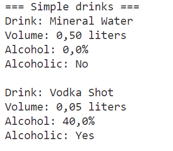
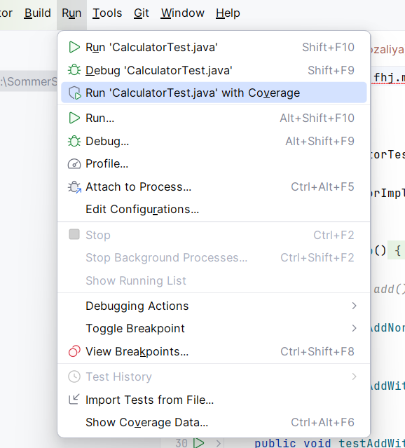
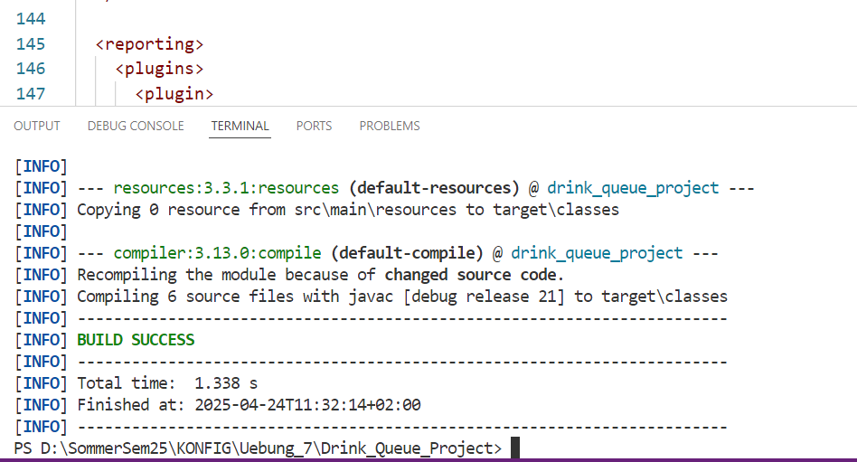
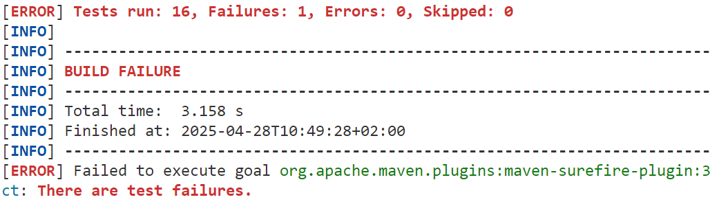
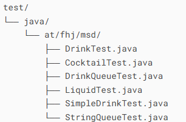
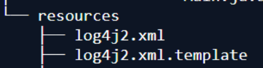

#  🍹 Drink_Queue_Project

**A simple program written in Java** designed to teach and practice the following concepts:

-  How to turn abstract ideas (queue operations) into working code.
-  How to use arrays to store elements.
-  Polymorphism: A reference of type IQueue can point to any implementation.
-  Good practice: Interfaces are preferred over concrete classes for flexible design.
-  Encapsulation: Classes hide their internal data (e.g., queue state) and provide public methods.
-  Polymorphism: Methods like peek() and element() have the same purpose but different error behavior.
  

## 🏗️ Features

1. Drink.java - abstract base class.

2. Liquid.java - class for liquid ingredients (alcohol, juice).

3. SimpleDrink.java - represents a drink with a single liquid.

4. StringQueue.java - implementation of a queue.

5. IQueue - describes the behavior of a queue for working with strings.

6. Main.java - a standard body of a Main class.

7. Cocktail.java - represents a cocktail drink consisting of multiple liquid ingredients.

8. DrinkQueue.java - implementing Drink interface in a queue.

   
## ⚔️Getting Started


1. Clone the repository or download the source code.
   
**To clone this project, run:**

```
bash git clone https://github.com/rozaliyaAleksandrova/Drink_Queue_Project 
```
Or copy the code from the README.md link you are currently reading.


2. 📝 Аdd main method.\
   
3. If you try to run the code without a main method you will get the following message in VSCODE

   
4. Compile the Java files using a Java compiler. A compiler can be downloaded from here:
   [jetbrain](//www.jetbrains.com)

We recommend:
[IntelliJ IDEA](https://www.jetbrains.com/idea/)
or
[Visual Studio Code](//www.jetbrains.com)

[Problems with the installation? Click here!](https://www.jetbrains.com/help/idea/getting-started.html)

1. Run the `main()` method in the Main class to see the output of the code.

### 📊 Example Output

When you run the application, you will see an output similar to the following:




**To copy the code:** 

[Copying the code from here!](./resources/images/.....png) 


## 🎊 How to make the code more interesting 🎊

You can create the drinks in your main() method in the Main class and then call the method:

[Download example from here!](./resources/images/Main_class_example.md)


## Test your code 


 Create drinks in your main() method in the Main class and then call the method to test whether individual classes are working correctly:

[Copy example from here!](./resources/images/testfile.md)

### Test Class and Setup 
In the folder Drink_Queue_Project\src\test\java\at\fhj\msd you will find all the test classes.
To run the `tests` and display the output of the code and whether the tests were successful.

In Intellij: right click on Run/Debug -> Run … with coverage
Or in VSCode via command in the console: mvn test




If the tests are **successful** you will see an output similar to the following:




And if the tests **are not successful:**




### 🪜 Structure

Мake sure you have the proper structure to execute the code. See the example below.⬇️\


Proper structure to execute the tests smoothly:




### Log4j2 Configuration

To enable logging in this project, ensure that you correctly configure the `log4j2.xml` file in the `src/main/resources` directory. A template file is included in the repository as `log4j2.xml.template`.



## 📋 Tasks List

- [x] Branch maven
- [x] Branch readme
- [x] Branchmaven_detail - pom.xml
- [x] Branch bug_hunt
- [x] Branch drink
- [x] Branch queue
- [x] Branch javadoc
- [x] Branch tests
- [x] Branch maven_site
  


## 🤝 Group members 


Mario Shenouda

[GitHub Profile - Shenouda](https://github.com/Juma2016)

Rozaliya Aleksandrova

[GitHub Profile - Aleksandrova](https://github.com/rozaliyaAleksandrova)


